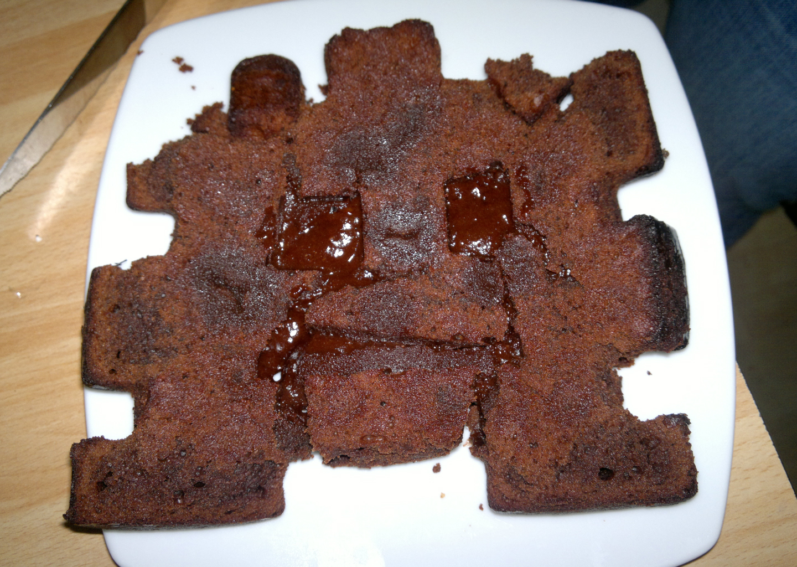

El texto alternativo **debe estar presente en todo el contenido multimedia de nuestro sitio o aplicación.** Para videos utilizamos los **subtítulos**, con el audio incluimos **transcripciones** y en el caso de las imágenes lo que utilizamos es el **atributo alt.** En todos los casos el objetibo es el mismo, transmitir ese contenido a los usuarios que encuentren impedimentos para acceder al formato inicial.

El proceso para agregar un atributo **alt** a una etiqueta de imagen es sumamente simple:

```html

```

Pero en términos reales, necesitamos asumir que es una de las cosas que peor hacemos en nuestro trabajo diario.

## ¿Qué escribimos en el atributo alt de nuestras imágenes?

**Todo tipo de barbaridades.** Los errores más comunes suelen incluir descripciones vagas como "Imagen", "Portada del artículo". A veces escribimos el título del artículo, de la página, o algo provisorio como "image alt", "alternative text" que finalmente nunca reemplazamos. En el peor de los casos, al no estar seguros, dejamos el atributo vacío o directamente lo eliminamos.

**El atributo alt debe incluir un texto equivalente a la imagen en cuestión.** Analicemos esto con un ejemplo para descubrir su verdadero potencial. Supongamos que necesitamos incluir en una página las siguientes imágenes:




Y que utilizamos en ambos casos el texto alternativo *"Torta de chocolate"*

## ¿Cuánta información estamos escondiendo?

Si herramientas de testeo automático como [Wave](https://wave.webaim.org/) o [Lighthouse](https://developers.google.com/web/tools/lighthouse) analizan esas imágenes, no van a detectar ningún error.  Y no podemos decir que la descripción sea equivocada, pero en un contexto de comparación, omitir las características que permiten diferenciar ambas imágenes es un grave error. Si no podemos ver las imágenes, el contenido que percibimos es completamente diferente.

El contexto es todo a la hora de escribir el texto alternativo de una imagen y para eso debemos tener en cuenta algunas cosas. Todas las imágenes deben incluir un atributo alt, pero las características de su contenido pueden variar según la circunstancia.

Lo primero que debemos preguntarnos es ¿qué función cumple esa imagen?

### Imágenes decorativas.

Si se trata de una imagen decorativa, que no transmite realmente otro mensaje más que ese detalle visual, como por ejemplo un borde, o una textura de fondo, debemos utilizar un atributo alt vacío. Aunque parezca un error, esta es la manera correcta de indicar que una imagen es irrelevante para la comprensión del contenido.

```html

```

### Íconos y botones.
Otro uso habitual de las imágenes en una interface de usuario son los íconos, ya sea acompañados de texto o como controles en sí mismos. Aquí podemos distinguir dos situaciones diferentes.

Si la imagen / ícono no está acompañada de texto, podemos utilizar el atributo alt de la imagen para indicar la función que cumple ese ícono, por ejemplo:

```html
<a href="./document.pdf">
  
</a>
```

En cambio, si la imagen está acompañada de texto, ese texto debe describir la acción. La imagen, al ser un elemento decorativo, sólo debe incluir un atributo alt vacío.

```html
<a href="./document.pdf">
   
  Download document in PDF format.
</a>
```

### Imágenes ilustrativas o representativas.

Por último, encontramos las imágenes o gráficos que se utilizan para ilustrar o representar un fragmento de contenido. En este caso, el texto alternativo debe ser equivalente a la información que transmite la imagen, teniendo el cuenta el contexto en el que se presenta. 

Es importante prestar atención a los siguientes aspectos:

* Tratar de ser conciso y específico al describir el contenido o la acción.

* No excluir información vital para entender el significado de la imagen en relación al contenido que acompaña.

* No incluir información redundante.

* No es necesario incluir en nuestro texto alternativo las palabras "Imagen de.. " o "Imagen que representa.. ". Si el formato de la imagen es relevante para el contenido, puede indicarse al final (por ejemplo alt=”Paisaje montañoso y nevado, ilustración.”).

* Siempre terminar la frase con un punto (.) para que la oración no suene inconclusa.

* Atrás deberían quedar aquellos días en que pensábamos que el atributo alt era sólo ese texto destinado a ser mostrado cuando el navegador no puede cargar las imágenes.

Comprendiendo la importancia del texto alternativo, habremos dado un gran paso hacia el objetivo de hacer que nuestro contenido sea accesible para toda la web!
